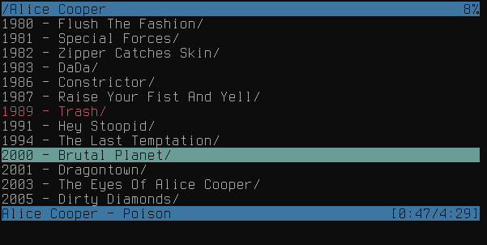

**Asp** is a [Chub](https://github.com/vchimishuk/chub) ncurses client.

### Screenshots


### Build and run
The app can build and run using standard `go` command.
```
$ go build
$ ./asp
```
It is also possible to easily build a package for some operation systems. See `dist` folder in the current source distribution.

### Configuration and keys
Asp is configured using `~/.config/asp/asp.conf` configuration file. See man page and `asp.conf.example` file in the current source distribution for details.
